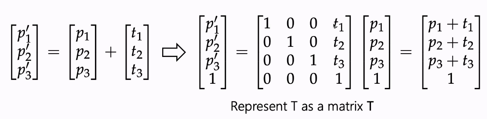

# 3D rotations

Homogenous matrix: 

$$
\left [
\begin {array} {}
\cos {\theta} & -\sin {\theta} & 0\\
\sin {\theta} & \cos {\theta} & 0\\
0 & 0 & 1\\
\end {array}
\right ]
$$

This is the 2d homogenous transform matrix. 

## 3D coordinate systems

Left hand and right hand coordinates, where thumb points to $+x$, index points to $+y$ and middle finger points to $+z$. Right hand is used in this course. 

## 3D rotation conventions

In 2d, rotations happen around a point. In 3D, becomes a 1D line: an axis. 

The right hand screw rule: the thumb aligns with the positive axis of rotation, and the fingers curling point to the positive rotation.

### Rotation about the $z$ axis

$$
\left [
\begin {array} {}
x'\\
y'\\
z'\\
\end {array}
\right ] = 
\left [
\begin {array} {}
\cos {\theta} & -\sin {\theta} & 0\\
\sin {\theta} & \cos {\theta} & 0\\
0 & 0 & 1\\
\end {array}
\right ]
\
\left [
\begin {array} {}
x\\
y\\
z\\
\end {array}
\right ]
$$

Here, $z$ values always stay the same. 

### Rotation around $y$ axis

To rotate around $y$, we swap the coordinates in order as such:

$$
x \to z\\
y \to x\\
z \to y\\
$$

Meaning that the $y$ now stays the same. 

In order to create the $R_y$ matrix (rotation around y axis) we simply match up the sums that the new re-ordered matrix creates. For $y$ for example, $z' = z\cos {\theta} -x\sin {\theta} + 0$. Thus we can build the matrix correspondingly.

$$
\left [
\begin {array} {}
x'\\
y'\\
z'\\
\end {array}
\right ] = 
\left [
\begin {array} {}
\cos {\theta} & 0 & \sin {\theta}\\
0 & 1 & 0\\
-\sin {\theta} & 0 & \cos {\theta}\\
\end {array}
\right ]
\
\left [
\begin {array} {}
x\\
y\\
z\\
\end {array}
\right ]
$$

In conclusion: 

## Euler Angles

There are 12 unique rotations. 

## Homogeneous transforms in 3D

## Affine maps

## Coordinate transformations

Translating between different coordinate systems