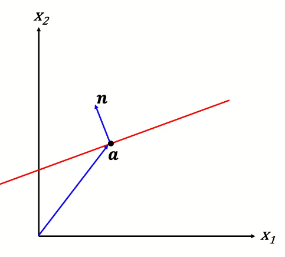

# Curves

## Representing 2D Curves

1. Explicit: $x_2 = f(x_1)$
    - representing one axis with respect to the other
    - cannot represent vertical lines ie. $x=0$, since dividing by zero to get the $y$ value is undefined.
    - cannot represent curves that output two values like circles
2. Parametric: $f(t) \mapsto (x_1, x_2) $
    - a function with maps parameter $t \to (x_1, x_2)$
    - $f(t) = a + t \cdot v$, where $a, v$ are n-dimensional vectors. 
    - for a circle for example, $f(t) = r \left [ \begin {array} {c} \cos t \\ \sin t \end {array} \right ]$, where $r$ is the radius. 
3. Implicit: $f(x) = 0$
    - if a value $x$ is on the curve, $f(x) = 0$, outside the curve is $f(x) > 0$, and inside the curve is $f(x) < 0$
    - let $a$ be a point on the curve and $n$ be the normal of the curve
    - if $n \cdot (x - a) = 0$, then $x$ is on the curve.  

    

- Parametric allows easy iteration along the path of a curve
- Implicit allows quick testing to see if a point is on, above, or below a curve
- Explicit is simple, but not convinient for multi-valued curves

## Modeling complex curves

Piecewise modeling have many endpoints which control the smoothness of the curve. Each curve is modeled separately with a different function, using parametric representation.

A curve is $C^n$ continuous if its $n^{th}$ derivative is smooth. 

$C^0$ shows us whether the curve is continuous at a point: $f(t) = g(t)$. 

$C^1$ shows whether a point is smoothly connected using the first derivative: $f'(t) = g'(t)$. 

The simplest choice for parametric is to use polynomials:

$$f(t) = \sum \limits _{i=0} ^n t^ix_i$$

Cubic polynomials are the simplest to use. 