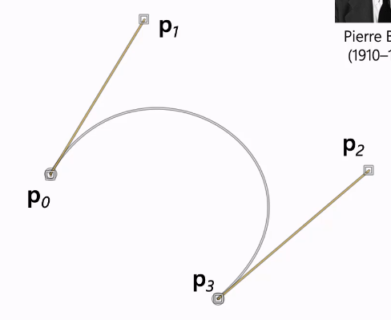

# Cubic Curves

Why cubic? 
- Lower order curves cannot be smoothly joined 
- Higher order curves introduce "wiggle"

The parameter $t \in [0,1]$

The general form of the cubic curve is:

$$p(t) = x_0 + tx_1 + t^2x_2 + t^3x_3$$

It can be rewritten as a matrix representation:

$$p(t) = \left [ \begin {array} {} x_3 & x_2 & x_1 & x_0 \end {array} \right ] \left [ \begin {array} {} t^3 \\ t^2 \\ t \\ 1 \end {array} \right ]$$

Using variables to represent the matrices:

$$p(t) = CQ(t)$$

where $C$ is the shape matrix, and $Q(t)$ is the parameterisation matrix. 

To find the derivative:

$$\frac {dp} {dt} = C \left [ \begin {array} {} 3t^2 \\ 2t \\ 1 \\ 0 \end {array} \right ]$$

## Polynomial Fitting

We want to specify the values and the gradients at the start and the end of the curve; for $t=0$ and $t=1$, which brings us to Hermite Curves.

## Hermite Curves

To fit the curves smoothly, we want to specify:
1. The endpoint values
2. The 1st derivatives at the endpoints

The shape matrix $C$ is broken down into two matrics: $G$, a 1x4 geometry matrix, and $M$, a 4x4 basis matrix, such that $C = GM$.

$$p(t) = \left [ \begin {array} {} p(0) & p(1) & p'(0) & p'(1) \end {array} \right ]Q(t)$$

This is how the blending matrix is derived:

$p(0) = x_0 + 0 + 0 + 0$
$p(1) = x_0 + x_1 + x_2 + x_3$
$p'(0) = 0 + x_1 + 0 + 0$
$p'(1) = 0 + x_1 + 2x_2 + 3x_3$

So:

$$
\left [ \begin {array} {} p(0) \\ p(1) \\ p'(0) \\ p'(1) \end {array} \right ] =
\left [ \begin {array} {} 
1 & 0 & 0 & 0\\
1 & 1 & 1 & 1\\
0 & 1 & 0 & 0\\
0 & 1 & 2 & 3\\
\end {array} \right ]
\left [ \begin {array} {} x_0 \\ x_1 \\ x_2 \\ x_3 \end {array} \right ]
$$

To find the $x$ values, we invert the blending matrix and multiply by our specified endpoint values and gradients. The blending matrix is always the same.

$$
\left [ \begin {array} {} p(0) \\ p(1) \\ p'(0) \\ p'(1) \end {array} \right ]^T
\left [ \begin {array} {} 
2 & -3 & 0 & 1\\
-2 & 3 & 0 & 0\\
1 & -2 & 1 & 0\\
1 & -1 & 0 & 0\\
\end {array} \right ]  =
\left [ \begin {array} {} x_0 \\ x_1 \\ x_2 \\ x_3 \end {array} \right ]
$$

The 4x4 matrix is the inverted, transposed blending matrix. 

## Bezier Curves

$$\frac {dp} {dt}(0) = 3 (p_1 - p_0)$$

$$\frac {dp} {dt}(1) = 3 (p_3 - p_2)$$

Bezier curves have the **convex hull property**. This means that the curve never leaves the polygon formed by the four $p$ points. This makes it very stable. 

### Piecewise

Since all curves go through $t=0$ to $t=1$, then for two connected curves $p(t)$ and $q(t)$, then to make them smooth:

$p(1) = q(0)$ and $p'(1) = q'(0)$. So their endpoints match and their derivatives at the endpoints match. 

### Catmull-Rom Curves

cooler than bezier curves