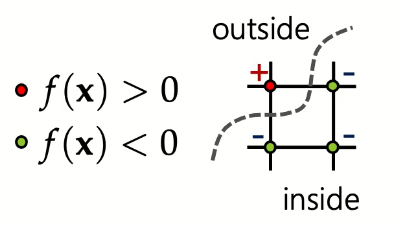
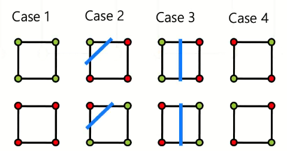
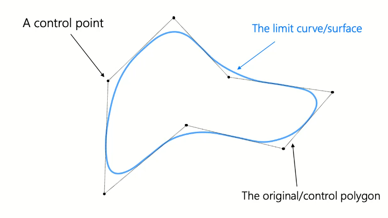

# Surface Representations

## 3D Surfaces

1. Explicit: $x_3 = f(x_2,x_1)$
    - for a sphere: $x_3 = \pm \sqrt {r^2 - x_1^2 - x_2^2}$
    - same limitations of the 2D representations
2. Parametric: $f(u,v)$
    - for a sphere: $f(\theta, \varphi) = r \left [ \begin{array}{} \sin \varphi \cos \theta \\ \sin \varphi \sin \theta \\ \cos \varphi \end{array} \right ]$
3. Implicit: $f(\vec{x}) = 0$
    - for a sphere: $f(\vec{x}) = \| \vec{x} \| - r$
    - $f: \mathbb {R}^3 \to \mathbb {R}$

Calculating implicit representations for 3d surfaces is intractable. 

## Boolean Operations on implicit surfaces

- Union of 2 surfaces: $f(\vec{x}) = \min(f_1(\vec{x}), f_2(\vec{x}))$
- Intersection of 2 surfaces: $f(\vec{x}) = \max(f_1(\vec{x}), f_2(\vec{x}))$

## Sampling implicit surface representation

Using a finite number of samples, label each point as either inside or outside the surface. 

Marching squares is fitting a curve between the inside nodes and the outside nodes. This approximates the contours of surfaces in 2D. 
- In 2D, there are $2^4=16$ combinations for the lines in each grid. However, some are equivalent:

Case 4 is ambiguous: it could take the diagonal through the centre as inside the curve, or take the corners of the square as inside the curve.

### Marching Cubes

There are now $2^8=256$ cases for the eight corners in the cube. This fits into 1 byte. The edge connectivity is stored in a lookup table and accessed using the 1 byte configuration. There are 15 unique cases (disregarding equivalent cases). 

The position of the cut vertices is computed by linear interpolation. 

## Subdivision Surfaces

Creates smooth surfaces on top of a course mesh. The mesh is recursively refined to achieve a smooth surface. This is done by either:
- approximation - original vertices are moved to new positions
- interpolation - new vertices are created to smooth the mesh

Convergence, smoothness