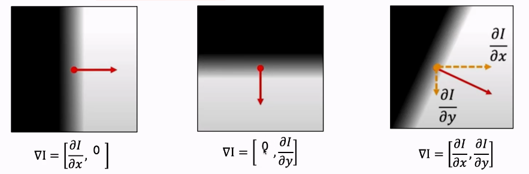
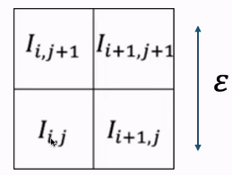
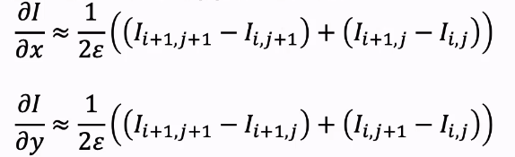
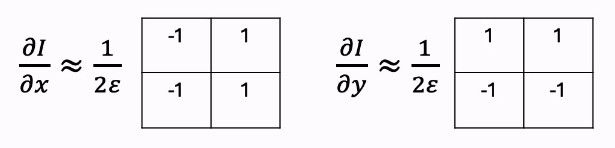
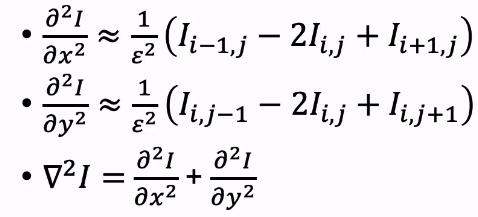
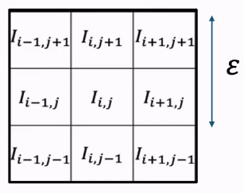

# Edges
An edge in 2D is a rapid change in image intensity within a small region. This is caused by:
- surface normal discontinuity
    - when the object is the same material but the normal changes so the light reflection changes
- depth discontinuity
- surface reflectance discontinuity
- illumination discontinuity

Types of edges
- step edges
- roof edges
- line edges

In the real world, edges are noisy and discrete. We want:
1. Subpixel edge position
2. Edge magnitude
3. Edge orientation
4. High detection rate
5. Good localisation
6. Low noise sensitivity

## Edge detection

### Using 1st derivative

A sudden spike in the first derivative of the function indicates the starts and ends of the edges. We then take the magnitude of the derivative:

$$\left\| \frac{df}{dx} \right\|$$

### Partial derivatives

The image is a function of the x and y axis: $I(x, y)$. We can take the partial derivative with respect to x and y:

$$
\nabla I = \left[ \frac{\partial I}{\partial x}, \frac{\partial I}{\partial y} \right]
$$

The magnitude $\nabla I$ is just square and the square root both partial derivatives. The orientation is $\theta = \tan ^{-1} (\frac{\partial I}{\partial y} / \frac{\partial I}{\partial x})$

### Discrete Gradients

Implemented as convolution: 

#### Kernels

Smaller kernels localise well, but are highly sensitive to noise and have poor detection. Larger kernels localise worse, but are less sensitive to noise and have better detection. 

### Edge Thresholding

1. Standard threshold: if the magnitude of the gradient is large enough, it is an edge
2. Hysteresis based threshold: if the magnitude is bigger than $t_1$, it is an edge. If it is bigger than $t_0$ and neighbouring and edge, it is an edge. Otherwise not. 

### Laplacian

- The sum of the second partial derivatives. 
- The edges are the zero-crossings of the second derivatives.

#### Discrete Laplacian

Since values can be less that 0, shift the range from $0 \to 255$ to $-128 \to 127$  

### Canny Edge Detector

### Corners

Harris corner response function