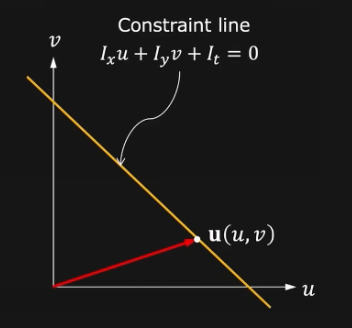

# Optical Flow

## SIFT Recap

Scale Invariant Feature Transform. Used for:
- image alignment/stitching
- 2D object recognition in video

- Interest points: blobs.
- Detecting blobs
- SIFT Detector
- SIFT Descriptor

### Extracting SIFT points

Apply Gaussians at increasing resolutions and calculate difference of Gaussians, which is an approximation of Laplacian. 

Then find extremum in every 3x3 grid. This yields interest point candidates, and after removing weak points we have SIFT points. 

## Optical Flow Definition

Method to estimate apparaent motion of scene points from sequence of images.

## Motion Field

In the scenario of a pinhole camera.

We can calculate the perspective projection using $f$: $\frac{r_i}{f} = \frac{r_0}{r_0 \cdot z}$ so $r_i = f \frac{r_0}{r_0 \cdot z}$

We can calculate the derivative to get the image point velocity using the quotient rule.

## Optical Flow

Ideally, optical flow is equal to motion field. 

Optical flow: $(u,v) = \left (\frac{\delta x}{\delta t}, \frac{\delta y}{\delta t} \right )$

### Constraint Equation

Assumptions:
1. Brightness of image point remains constant over time.
2. $\delta x, \delta y, \delta t$ are very small.

So we get $I_xu + I_yv + I_t = 0$

### Taylor Series

Expand a function as an infite sum of its derivatives. The delta values must be small (<1) so that the series converges. For small enough deltas, we can discard the derivatives greater than order of 1. 

### Computing Partial Derivatives using Finite Differences

### Geometric Interpretation

