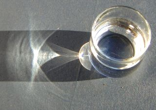

# Geometric Modelling

## WebGL

- JavaScript library, not compiled and runs locally on your machine. 
- Subset of OpenGL for embedded systems

## Painting

- Painting by colour does not take lighting into account - it makes the object look flat.
- Using lighting information, model geometry and camera position allows the object to be painted by lighting

## Phong Lighting Model

- Based on light behaviour in the real world, but is an approximation
    - Specular highlights - only on shiny surfaces, dull surfaces have large highlights that fall off gradually, diffuse
    - Ambient term accounts for light scattered equally about the entire scene
- Only considers reflections from a single object - does not consider inter-reflections

## Ray Tracing

- reflections
- refraction
- soft shadows
- motion blur
- no caustics or diffuse inter-reflections

This is very expensive to compute.

Caustic:

