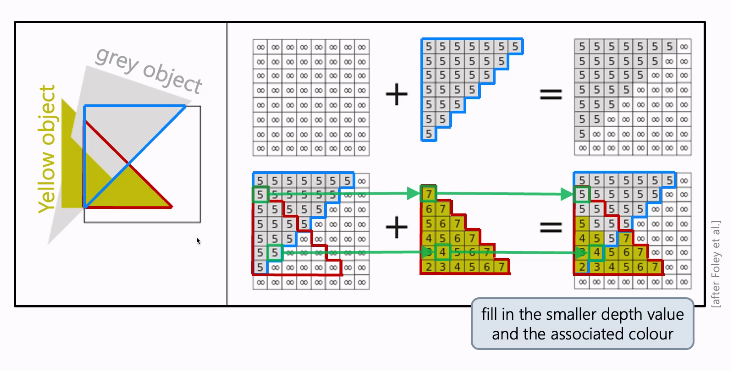

# Graphics Pipeline

The pipeline:

```javascript
function VertexProcessing(vertex_data) -> transformed_geometry
function ClippingAndRasterisation(transformed_geometry) -> interpolated_fragments
function FragmentProcessing(interpolated_fragments) -> fragment
function FrameBufferProcessing(fragment) -> image
```

Stylised as code for fun :).

## `VertexProcessing`

- Applies transformation from object space to camera space
- Computes **vertex** normals if they are not provided
    - compute average surface normal from surrounding faces
    - normalise to ensure unit length
- Pass along the material and shading (left alone)

## `ClippingAndRasterisation`

- Turns sets of vertices into primitives and fills them in
- Remove objects not in the view frustum
- For closed shapes, only draw the surfaces facing the camera - backface culling
- Point plane clipping - check whether a point is behind a plane
    - done using dot product between normals
- Line (segment) clipping
    - test whether a line intersects, or is behind a plane, and clip/cull as necessary
- Rasterisation - approximate primitives into pixels, centred at integer coordinates

## `FragmentProcessing`

- Compute final fragment colours and depth
    - Depth is often untouched
    - Lots of texture mapping
    - Final lighting computations

### Lighting

- Flat shading - faces are shaded according to their normal
- Gourad shading - faces are shaded by interpolating between vertex normals
- Phong shading - faces are shaded by interpolating between vertex normals per pixel, and compute shading for each pixel

### Texture mapping

stuf

## `FramebufferProcessing`

- Eliminate hidden surfaces
- Framebuffer blending - compose transparent processes

## Painter's Algorithm

- Simplest way to handle hidden surfaces
- Draws from back to front, painting over occluded surfaces
- Wasted work!

## Z-buffer

- Allocate buffer to store closest depth so far for each pixel
- When drawing an object, compare its depth to the depth buffer valuie

