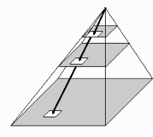

# Image Matching

## 3D images from 2D images

Using the stereo normal case, you can triangulate the 3D position of a point given two pictures where the camera is in a known position.

- Points of interest can be determined manually or automatically.

## Template Matching

- Template is usually much smaller than the image
- Find the location of the template in the image
- Using Cross Correlation

### Cross Correlation

Same as convolution but kernel isn't flipped.

Assumptions: image is only
1. Translated
2. Changed in brightness
3. Changed in contrast

- Normalised CC: subtract mean from both template and image and divide by the square root of the square of both.
    - 1 is exact match

- Exhaustive search: correlating the template over the entire image and find the highest value for $u$ and $v$.
    - Sliding window approach.

### Course to Fine - Image Pyramid

Iteratively resize the image, from small to large. The match gives the intialisation for the next step - this avoids searching the entire image.