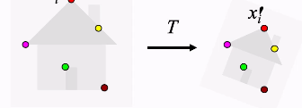
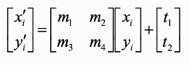
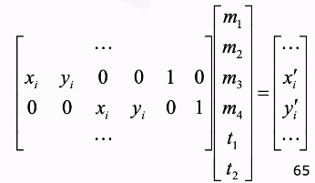

# Image Matching

- Template matching
- Stereo normal case

## Least Squares Matching

Alignment as fitting

Use line fitting to fit the points to the transformed points - least squares.

## Fitting affine transformation

Rearrange to this:

