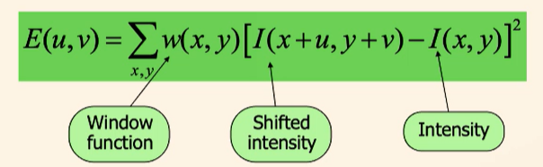
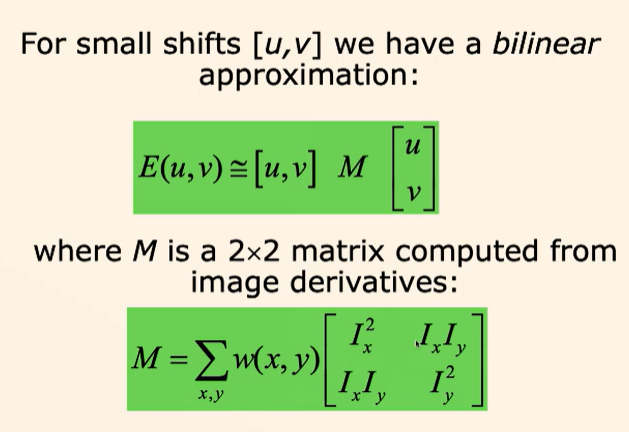
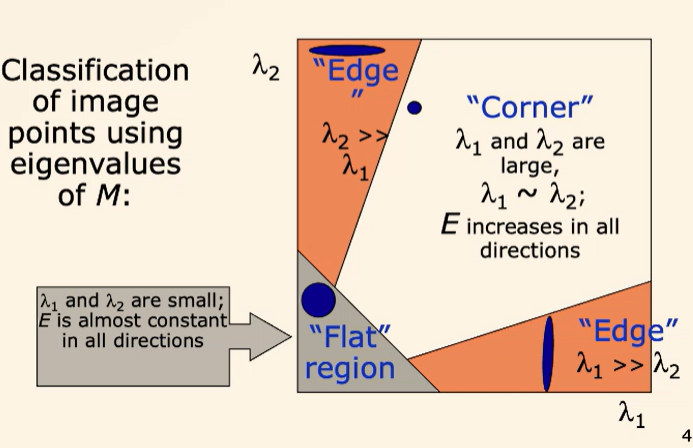

# Image Matching and Alignment

Two main methods:
- direct (pixel based) aligment
- feature based alignment - affine transformations
    - finding an affine trans that minises a loss function (distance between corresponding features)

## Feature Extraction

- Keypoints are points on the image 
- Descriptors are a vector that represent some information about the keypoint.  

Advantages of local features:
- locality 
- distinctiveness
- quantity
- efficiency
- extensibility 

### Corner detection 

The idea is to be able to recognise a point through a small window, and changing the window a small amount **in any direction** should result in a large change on intensity. This identifies corners instead of edges.

The window function $w$ can either be a step function for only pixel values inside the window or a smooth gauss.

$M$ can be computed for the whole image, it does not depend on $u$ and $v$. This speeds up computation.

For eigenvalues of $M$ $\lambda_1$ and $\lambda_2$:

 

The corner response function $R$ is

$$R = \lambda_1 \lambda_2 - k(\lambda_1 + \lambda_2)^2$$

where $k$ is a constant usually between 0.04 and 0.06.

Set a threshold such that if $R$ is larger than the threshold, it is classed as a corner.

## Feature Matching