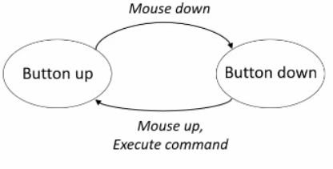
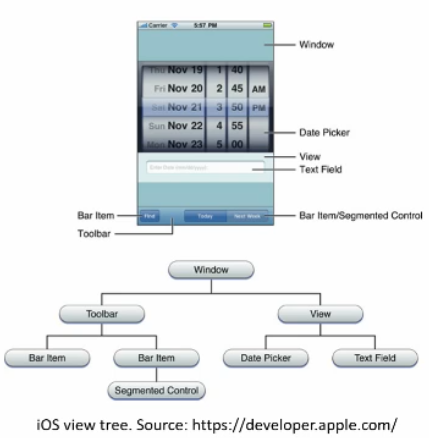
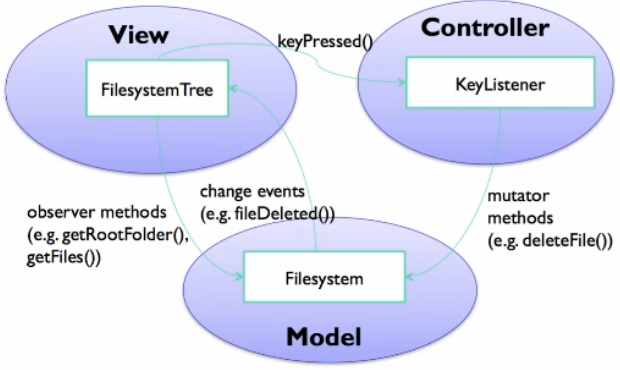

# User interfaces

Interactive systems need 3 integral parts:
1. Computer
2. Human
3. Interface

## Computer

- Takes input and produces output using functions.
- Computers can be governed by the concepts of input, output and algorithms/functions.
- Deterministic

### Input

Any kind of data a user provides to a computer.
- low level events: keystrokes, mouse position etc
- aggregation of low level inputs, for example text strings
- user interfaces provide users control through which to provide inputs with valid structures
- inputs can be implicit or explicit

#### Explicit vs Implicit Example

Google search engine

##### Explicit
- search box
- google search button
- microphone button

##### Implicit inputs
- search history
- sensor (eg gps) inputs

Things that the user doesn't directly input themselves. They often have a default value.

## How UIs work

Most interfaces are based on the WIMP design:
- Windows
- Icons
- Menus
- Pointers

These are not fundamental, there are other solutions too.

### Direct manipulation

WIMP realises direct manipulation. This is characterised by:
- continuous representation of the object of interest
- physical actions instead of syntax
- reversable, incremental actions, continuous feedback

These characteristics allow the user to rapidly learn the UI.

### How they work at a low level

Three concerns:
1. Event handling
2. Rendering the UI (output)
3. Managing application states

#### Button example

A button can be represented by a FSM:

All UI widgets are implemented by defining states and events that cause transitions.

#### Model-View-Controller (MVC)

MVC is a pattern for implementing the state machines.

1. The model stores the data the UI is presenting.
- e.g. a scroll bar's data is the window position over the content
2. The view visualises the data
- e.g. drawing the scroll bar itself
3. The controller manages the state machine: transitions between states responding to events and updates the model.
- e.g. updates the windows position within the model

#### View Hierarchies (view trees)

Each widget has its own MVC, so they are composed into view hierarchies. Each widget has some or 0 children and a parent, except for the root which doesn't have a parent.

VHs determine:
1. Output
- UI changes the output by mutating the view tree
- redraw algorithm redraws affected areas
2. Input
- views have input handlers and listeners, and the view tree controls the propagation of events.

#### Event handlers

UIs typically handle input based on the listener pattern (observer, publish-subscribe)

An event source generates a stream of continuous events.

Views subscribe to events by providing a function to be called when an event occurs. 

#### MVC example

