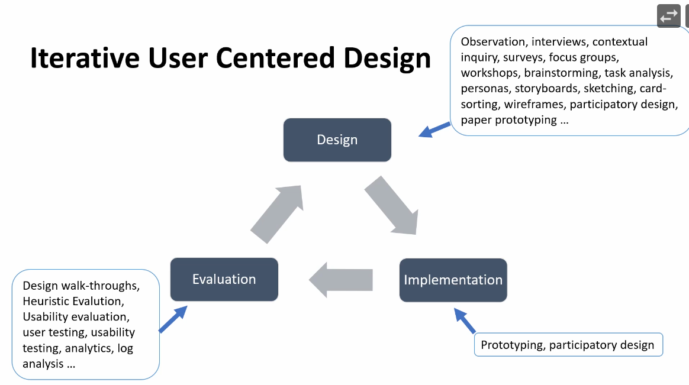

# UCD

- Opposite of system centred design. 
- Iterative design that puts the user at the centre of design decisions.
- A design philosophy,

Three principles:
1. Clarity of user and task requirements
2. Integration of user feedback iteratively
3. Active involvement of the user throughout the design process.

Users don't tend to be able to articulate their requirements, so we:
- Explore the problem space
- Investigate who the users are
- Investigate user activities
- Try out ideas and iterate

# Task analysis

Approaches:
1. Task decomposition
   - splitting task into ordered subtasks
2. Knowledge based techniques 
   - what the user knows about the task and how it is organised
3. Entity/object analysis
   - relations between objects and actions and who performs them 
