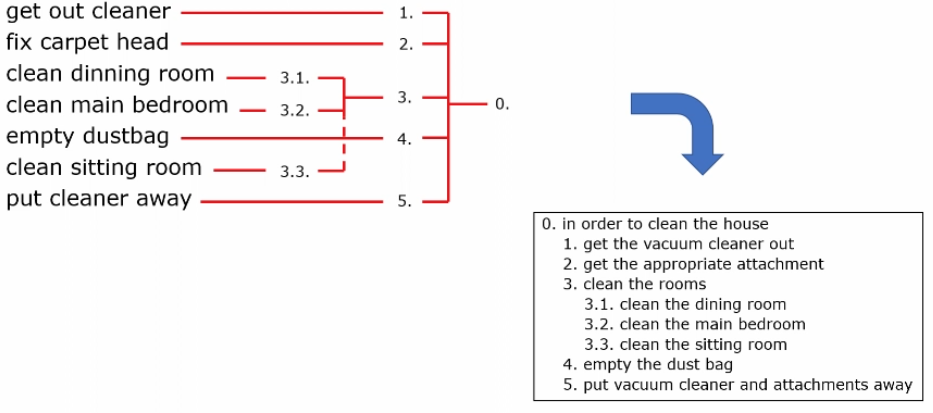
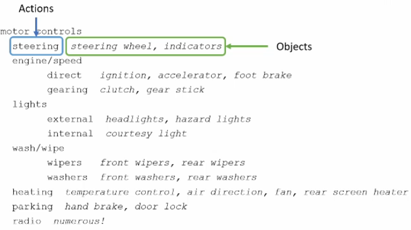
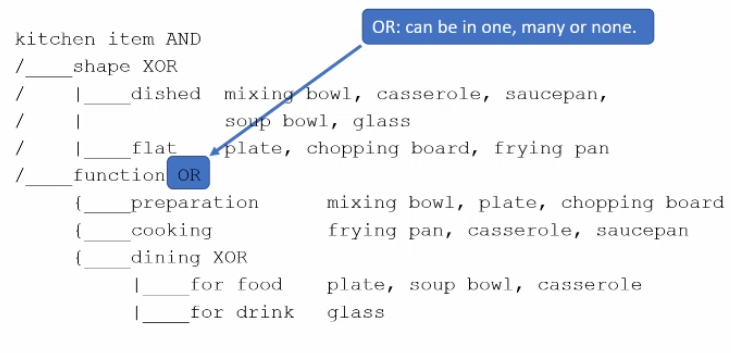
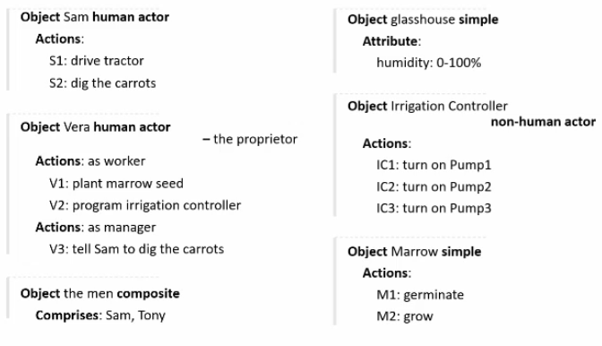
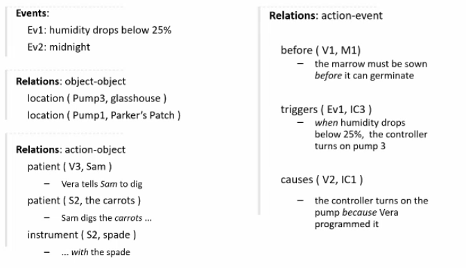

# Task Analysis

## Decompositional Task analysis

Task decomposition aims to:
- describe actions people do
- structure them within task-subtask hierarchy
- describe order of subtasks

### HTA 

How do we generate hierarchies?
1. Get list of tasks
2. Group tasks into higher level tasks.
3. Decompose lowest level tasks further.

Example:

Heuristics for refining HTA for making tea:
1. Are actions paired? e.g. turn on gas, turn off gas
2. Do we need to restructure tasks?
3. Do we need to balance tasks? e.g. pour teas is easier than make pot
4. How do we generalise the example? e.g. make one cup or more

### Types of plans

1. Fixed sequence: do 1, do 2, ...
2. Optional task: do 1 if 2...
3. Wait tasks: do 2 once 1 is finished
4. Cycles: do 1 and 2 while...
5. Time sharing: while doing 1, do 2
6. Discretionary: do 1, 2, 3 in any order

## Knowledge Based Techniques

Focuses on:
1. Objects
2. Actions

We can use three types of branch points:
1. XOR - an object is in one and only one branch of a normal taxonomy.
2. AND - an object must be in multiple classifications.
3. OR - an object can be in one, many, or none.

In this example, the shape can be dished OR flat, not both, but can be used for any or none of preparation, cooking and dining.

These diagrams need to uniquely describe each object.

## Entity-Relationship Techniques

Start with a list of objects and classify them.

Concrete objects:
- simple things: spade, plough,...

Actors:
- Human actors

Composite objects:
- a team (of actors)
- tuples of objects

Objects also have attributes, similar to class based programming. 

Actions:
- have an agent (who performed the action)
- patient (the object the action was performed on)
- instrument (the object the action was performed using)

### Example

### Events

- Could happen after an action
- Could be spontaneous
- Could be a timed event

### Relationships

1. Object-object
2. Action-object
3. Action-event

