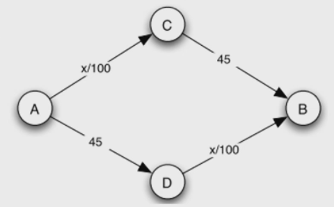
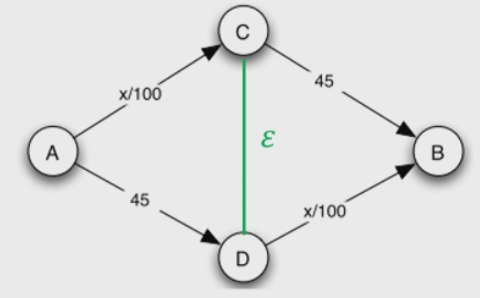
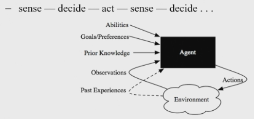
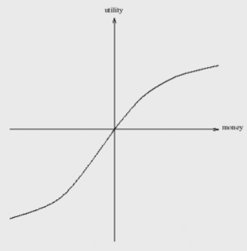

# What is intelligence?

## Traffic example

### Braesse's Paradox

From $A \to D$, travel time is 45 minutes. From $D \to B$, travel time is $x$ (the number of cars) over 100. 

If there were 4000 cars, getting from $A \to B$ would take $45 + 2000/100 = 65$ minutes, since there are two paths.

If we create a road between C and D with 0 travel time, then with 4000 cars travel time can be $4000/100 + 4000/100 = 80$ minutes, while the other roads stay out of use. This is slower than before.

This all means that agents actions need to be considered in multi agent systems to be rational.

# Intelligent Agents and Multi Agent Systems

An agent is a computer system that is able to independently act on its own. It is a discrete entity with its own goals and behaviours, and is autonomous that can adapt and modify its behaviours.

An agent has a continuous interaction with its environment:

## Preferences

Outcomes: $\Omega = \set {o_1, o_2, ...}$

Preferences: $o_1 > o_2, o_1 \sim o_2, o_1 \geq o_2$
- which outcome is preferred to which

Axioms
- Completeness: exactly one of $o_1 > o_2, o_1 \sim o_2, o_1 < o_2$ holds
- Transitivity: if $o_1 < o_2$ and $o_2 < o_3$ then  $o_1 < o_3$
- Continuity: if $o_1 < o_2 < o_3$ $\exists p \in (0,1) | o_2 \sim po_1 + (1-p)o_3$
    - this means that there has to be a linear combination of $o_1$ and $o_3$ that are indifferent to $o_2$.
- Independence: if $o_1 < o_2$ then $\forall o_3$ and $p \in (0,1]$ such that $po_1 + (1-p)o_3 < po_2 + (1-p)o_3$ 

## Von Neumann - Morgenstern Utility Theorem

Theorem if these axioms hold, then there exists a unique function (that uses only addition and multiplicative sclaing) $v$ such that if $o_1 < o_2$ then $v(o_1) < v(o_2)$

### Utility

The utility function is usually concave, as shown above. Utility can be interpreted as satisfaction, or happiness.

### Expected Utility

There is usually uncertainty with outcomes:

Lottery $L = [p_1,o_1; p_2,o_2; p_3,o_3;...]$

The expected utility of the lottery is: $E[U(L)] = \sum _i p_i U(o_i)$

### Rationality

Maximising expected utility 

There exists
- pefect rationality - knowing complete information
- bounded rationality - cognitive limits e.g. computational limits, the agent approximates the best action within constraints

### Risk averse, neutral, seeking

- Risk averse agents: willing to accept lower utility for a more certain outcome
- Risk neutral agents: maximise expected utility
- Risk seeking agents: prefer higher expected utility even if those options are lower certainty

#### Example

1. Gain £50 for certain 
2. 50% chance of getting £0 and 50% chance of getting £100

Risk-neutral agent is indifferent between both since expected utility is the same.

### Agent Design and Society Design

- Agent design: build agents capable of independent autonomous actions
- Society design: build agents that are capable of interacting with each other to carry out tasks when other agents in the system may not have the same goals or interests

#### Society design: Multi agent systems

- Consists of a number of agents that interact with one another