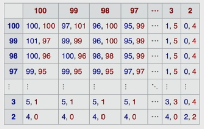

# Normal Form Games

## Types of games

1. Simultaneous to move games
2. Turn based games

## Defining games

We need:

1. A set of players $\set {1,2,...}$
2. A set of strategies/actions
   - Countable: $S_i = \set {a_1, a_2,...}$
   - Uncountable: $S_i = [0,1]$ (irrational)
3. A set of outcomes $O = \set {o_1, o_2,...}$
4. Game rules - a function from the set of strategies to the set of outcomes.
   - $f: S \to O$
5. Payoff/utility
   - $u_i(o): O \to U$

## Standard representations

- Normal form games
  - Players move simultaneously 
  - e.g. rock paper scissors
- Extensive form games
  - Players move sequentially
  - e.g. chess

## Prisoner's Dilemma

- No communication between prisoners
- Simultaneous 

### Normal form representation 

$C$ = confess, $D$ = don't confess

Payoff matrix for prisoner A

$$
\begin {array} {c|cc}
 & C & D\\
\hline
C & -5 & -1\\
D & -20 & -2\\
\end {array}
$$

Payoff matrix for prisoner B

$$
\begin {array} {c|cc}
 & C & D\\
\hline
C & -5 & -20\\
D & -1 & -2\\
\end {array}
$$

Bimatrix game

$$
\begin {array} {c|cc}
 & C & D\\
\hline
C & -5,-5 & -1,-20\\
D & -20,-1 & -2,-2\\
\end {array}
$$

## How to solve a Game

### Better Response Strategy

This is a strategy that produces a more favourable outcome for a player than another strategy, taking other players' strategies as a given.

We say $s_i$ is a better response strategy than $s'_i$ against other players' stragety profile $s_{-i}$ if $u_i(s_i, s_{-i}) > u_i(s'_i, s_{-i})$.

Notation: $s_{-i}$ is every player's strategy from $1,2,...,n$ not including player strategy $i$. So $s_{-2} = \set {s_1, s_3, ..., s_n}$.

$s_i$ and $s'_i$ are two different strategies from player $i$.

### Best Response Strategy

Taking all possible strateies into account:

$u_i(s_i, s_{-i}) > u_i(s'_i, s_{-i})$ for all $s'_i$.

### Dominance

Stronger comparison of strategies comparing to better or best, because they fix opponents strategies. This method lets opponents play any strategy.

For an individual agent, $s_1$ dominates $s_2$ if by playing $s_1$ the agent receives strictly better payoff for all players' responses than by playing $s_2$.
- rational players never play strictly dominated strategies.

For an individual agent, $s_1$ is a dominant strategy if it receives better payoff than all other strategies by playing it, regardless of what other players do. 

#### Prisoner's Dilemma example

From A's POV:

Payoff matrix for prisoner A:

$$
\begin {array} {c|cc}
& C_B & D_B\\
\hline
C_A & -5 & -1\\
D_A & -20 & -2\\
\end {array}
$$

If player B (column player) chooses to confess, then player A's best option is to also confess $(-5 > -20)$. If player B chooses to not confess, then player A's best option is still to confess $(-1 > -2)$.

So the dominant strategy for both prisoners is to always confess.
- This is called the dominant strategy equilibrium.

Note:
There always exists a best response strategy, but there doesn't always exist a dominant strategy. For example:

$$
\begin {array} {c|cc}
& S_1 & S_2 & S_3\\
\hline
S_1 & 1 & 1 & -1\\
S_2 & 2 & 3 & 2\\
S_3 & 3 & -1 & 3\\
S_4 & -2 & 1 & 2\\
\end {array}
$$

For the row player, the best response strategy for the fixed opponent strategy $S_1$ is $S_3$, but for the opponent strategy $S_2$ the best response if different, so there exists no dominant strategy.

### Elimination of dominated strategies

In this example, we can see that for the row player (blue) should always choose 99 over 100. Every outcome is better when 99 is chosen over 100, so 99 dominates 100. We can hence remove the 100 row.

We also see that the column player's 99 dominates 100 so we can remove this column as well. 

This process can be iteratively done until one (or at least less) strategy is left.

### Nash Equilibrium

- Pure strategy (deterministic action of a player)
- Pure Nash equilibrium 
  - each player has chosen a pure strategy and no player can benefit by changing their strategy if other players stay the same.
- Mixed strategy (a probability distribution over pure strategies)
- Mixed Nash equilibrium
  - A Nash equilibrium where players can use mixed strategies.

### Expected Utility

We represent strategies as vectors.

For a pure strategy, the vector might look like $x^T = (0,0,1,0)$, whereas for a mixed strategy the vector might look like $x^T = (0.1,0.2,0.5,0.3)$.

If the row player (A) has $m$ strategies and the column player B has $n$ strategies, we can describe expected utility as such:

Row player strategy: $x = (x_i)_{i \in [m]}$
- $x_i$ is the probability of playing strategy $i$
- $x_i \geq 0$, all probabilities sum to 1.
- The payoff matrix is therefore $A_{m \times n} = (a_{ij})_{i \in [m], j \in [n]}$

Column player strategy: $y = (y_j)_{j \in [n]}$
- The payoff matrix is $B_{m \times n} = (b_{ij})_{i \in [m], j \in [n]}$

The expected utility of player A, $E[U_i] = x^T A y$.
- The first matrix multiplication flattens $A$ to a $m$ vector, which is then reduced to a single number when multiplied with $y$ which is also an $m$ vector.

The column players expected utility is $x^T B y$.

### Nash Equilibrium (formally)

Pure and mixed NE (two players)
- $(x,y)$ is a NE of the game if:
  - $\forall x' \neq x, x^TAy \geq x'^TAy$ 
    - this means that strategy distribution $x$ is better or equal utility to all other strategies the player can choose
  - $\forall y' \neq y, x^TBy \geq x^TAy'$ 

### Support of a strategy

Support of a strategy $x$ is $\text {supp}(x)$ 
- the set of pure strategies that the player plays with a positive probability.
- the number of non-zero probabilities.

$\text {supp}(1,0,0,0)^T = \set {s_1}, \text {supp}(0.9,0.05,0.05,0)^T = \set {s_1, s_2, s_3}$

So a support value larger than 1 means the strategy is a mixed strategy.

#### Support Lemma

Lemma: given a finite strategy game, $(x,y)$ is a mixed NE if and only if every pure strategy in the support of $x$ is a best response to $y$, and vice versa.

Given the opponent's strategy $y$ and utility matrix $A$, we can say that all strategies in the support of $x$ should have equal payoff. For example:

$$E[U] = x^TAy$$

Suppose that $Ay = (1,20,9,3)^T$. Then $x$ must be $(0,1,0,0)$.

Suppose that $Ay = (1,20,20,3)^T$. Then $x$ must be $(0,p,1-p,0)$.

In the second example, the pure strategies of the support of $(0,p,1-p,0)$ still get the payout of 20.
