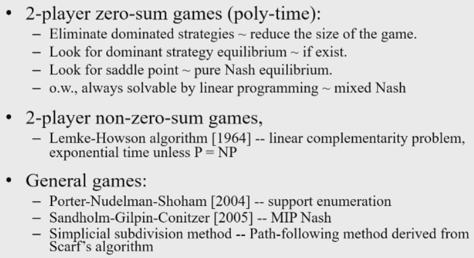

# Computing Mixed NE

## Husband vs wife example

$O$ = watching opera
$F$ = watching football

$$
\begin {array} {c|cc}
& O_h & F_h\\
\hline
O_w & 2,3 & 0,0\\
F_w & 0,0 & 3,2\\
\end {array}
$$

Using the support vector lemma:

$x$ is husband and $A$ is husband's payoff matrix
$y$ is wife and $B$ is wife's payoff matrix

As husband, we want to choose a strategy that supports the max values of $Ay$. 

$$
Ay = 
\begin {pmatrix}
2 & 0\\
0 & 3\\
\end {pmatrix}
(q,1-q)^T
= (2q, 3-3q)^T
$$

$$
x^TB = 
(p,1-p)^T
\begin {pmatrix}
3 & 0\\
0 & 2\\
\end {pmatrix}
= (3p, 2-2p)^T
$$

If this is a mixed equilibrium, then $2q = 3-3q$, so $q = \frac {3} {5}$. Symmetrically, $p = \frac {3} {5}$.

## Two player zero sum game

A game where one player's game is the other player's loss. 

$B = -A$

### Minimax

$$
\begin {array} {c|cc}
& L & R\\
\hline
T & 3 & 2 & (2)\\
M & 5 & -10 & (-10)\\
B & -100 & 1 & (-100)\\
& (-5) & (-2)
\end {array}
$$

Thinking in terms of the column player, if the row player chooses $T$ then the worst outcome for column is $2$. The worst outcome on $M$ is $-10$ and the worst outcome on $B$ is $-100$. 

Because $B = -A$, the row player wants the greatest negative number. So the worst outcome if column chooses $L$ is $-5$, and the worst outcome if column chooses $R$ is $-2$.

We can see that both players agree on the cell $TR$ since these are the highest minimum payoffs for each. This is a pure NE, also called a saddle point. The value of the game is therefore $2$.

This procedure may not lead to a NE:

$$
\begin {array} {c|cc}
& L & R\\
\hline
T & 3 & 2 & (2)\\
M & 5 & -10 & (-10)\\
B & -100 & 4 & (-100)\\
& (-5) & (-4)
\end {array}
$$

For column player: $\max _x \min _y x^TAy = 2$
For row player: $\min _y \max _x x^TAy = 2$

#### Theorem

For any $\max _x \min _y x^TAy \leq \min _y \max _x x^TAy$ there exists $x,y$ (possibly mixed) such that $\max _x \min _y x^TAy = \min _y \max _x x^TAy$.

This is a NE. This can be computed by linear programming. 

## Computing a mixed NE using Linear Programming

The following is a zero sum two player game:

$$
\hspace{1.5cm} \text{player 2}\\
\text{player 1}
\begin {array} {c|cc}
& s_1 & s_2\\
\hline
s_1 & 3,-3 & -1,1\\
s_2 & -2,2 & 1,-1\\
\end {array}
$$

Player 1: $(x, 1-x)$
Player 2: $(y, 1-y)$

Expected payoff for player 1 is:
- $3x - 2(1-x)$ if player 2 picks $s_1$
- $-x + (1-x) = 1 - 2x$ if player 2 picks $s_2$

### Computing player 1's strategy

Player 1 should choose an $x$ to maximise the following:

$z = \min (3x - 2(1-x), 1 - 2x)$.

#### As a linear program

Objective: maximise $z$
Subject to :
- $3x - 2(1-x) - z \geq 0$
    - derived from $z \leq 3x - 2(1-x) - z$
- $1-2x - z \geq 0$
    - derived from $z \leq 1-2x$ 
- $x \leq 1$
- $x \geq 0$

### Computing player 2's strategy

Player 2 should choose a $y$ to maximise the following:

$z = \min (-3y + (1-y),-2y -(1-y))$.

## Approximate NE

When we are looking at pure and mixed NE, we say that strategies $(x,y)$ are a NE if:

1. $x^TAy \geq x'^TAy \ \forall x' \neq x$
2. $x^TBy \geq x^TBy' \ \forall y' \neq y$

If we want an approximate NE, then we provide an $\epsilon$ error:

1. $x^TAy + \epsilon \geq x'^TAy \ \forall x' \neq x$
2. $x^TBy + \epsilon \geq x^TBy' \ \forall y' \neq y$

## Computation times

