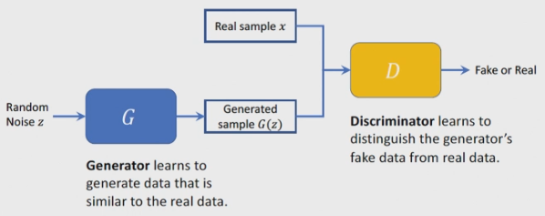
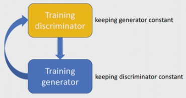
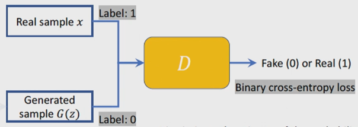
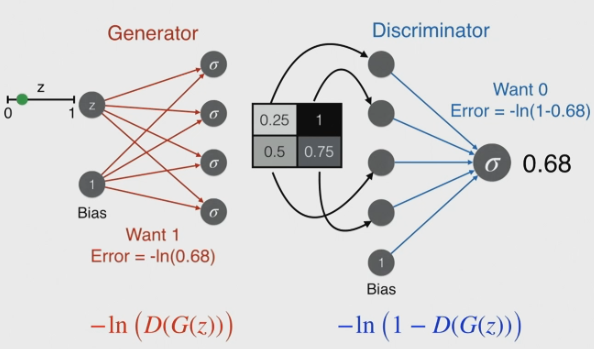

# Generative Adversial Networks

- GANs can be used to generate more labelled training data. 
- Also used for advertising so no model has to be used.

## Adversial meaning

A GAN is a pair of networks:
1. Generative model
    - tries to generate better quality images through training
2. Discriminative model 
    - tries to discern between real and generated images 

## High Level Structure

The networks are trained one after the other, and play a two player minimax game.

The value function of the game is:

$$\min \limits _G \max \limits _D V(D,G) = \mathbb {E}_{x \sim p_{\text {data}}} [\log D(x)] + \mathbb {E}_{z \sim p_{z}} [\log (1 - D(G(z)))]$$

### Discriminator 

The loss of the discriminator is defined as:

$$L_D = -\mathbb {E}_x [\log D_{\theta_d}(x)] - \mathbb {E}_z [\log (1 - D_{\theta_d}(G_{\theta_g}(z)))]$$

$D_{\theta_d}$ is the discriminators estimate that the real sample is real.
$D_{\theta_d}(G_{\theta_g}(z))$ is the discriminators estimate that the generated sample is real.f

### Training 

Using an example where real images are a up and left black diagonal line, this example shows how error is calculated for the networks.

Here, the discriminator should aim to get a score as close to 0 as possible.

### Discriminator objective function

For a real image:
Error = $ - \ln (\text {prediction})$

$-\ln(0.1) = 2.3$ is a high error.

For a generated image:
Error = $ - \ln (1 - \text {prediction})$

$-\ln(1 - 0.9) = 2.3$ is a high error.

### Generator objective function

For a real image, there is no loss since the generator has no part in this. 

For a generated image:
Error = $ - \ln (\text {prediction})$

## Nash Equilibrium

The NE is reached when:
- the generator produces data sucn that the discriminator cannot distinguish between real and generated
- the discriminator gives a 50% probability of classifying  generated data

Here, the discriminator cannot improve its performance unless the generator changes its strategy, because the generator's images are so high quality. 

The performance of both players is optimal *given the strategy of the other player*. 

The action set of the players in a GAN is changing the weights of the neural network