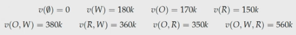
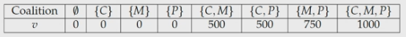
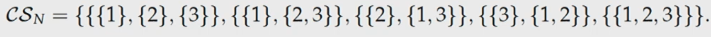
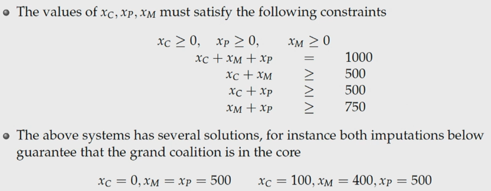
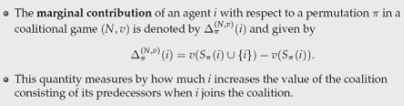
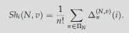

# Coalitional Games

Cooperative games model situations where plays may conclude binding agreements that impose particular action of series of actions on other players. 

A coalitional game is defined as:
- $N$ is the finite set of players. 
    - A subset $S \in N$ is called a coaltion. The collection of all coalitions is $2^N$.
- $v: 2^N \to \mathbb R$ is a function associating every coalition $S$ with a real number $v(S)$, satisfying $v(\empty) = 0$. This is the coalitional function of the game. 
    - If the members of $S$ agree to form the coalition, they can expect to receive utility of $v(S)$. 
- Utility can be transferred between players.
- The coalition of all players is called the **grand coalition**.
- When players form a coalition, all players must agree to join. 
- For two coalitions, $S \cap T = \empty$.
- Coalitions' utility does not depend on others. 

## Superadditive games

A coalitional game $(N,v)$ is said to be superadditive if it satisfies:

$$v(S) + v(T) \leq v(S \cup T)$$

For every disjoint pair $S,T \subseteq N$.

- Any player does not have a reason to not join the larger coalition. 
- It is usually assumed that the grand coalition is formed, since they earn $\geq$ what they would earn in smaller coalitions. 

### Example 1

A coalitional game can be described solely using the utility functions of the coalitions. 

for the three players $W, O, R$. Joining larger coalitions hear yields same or greater utility, so it is superadditive. 

### Example 2

Charlie has £3, Marcie has £4 and Pattie has £5.

Ice cream costs: 500g = £7, 750g = £9, 1000g = £11

## Simple Games

A coalitional game is called simple if for each coalition $S$, $v(S) \in \set {0,1}$. 
- The coalition is called winning if $v(S) = 1$ and losing if it is 0. 
- Representing winning coalitions as a family:
$$\mathcal W = \set {S \subseteq N | v(S) = 1}$$

## Weighted Majority Games

A weighted majority game is a form of simple game that has a quota $g \geq 0$ and non negative weights $w_i, i \in N$, one for each player, such that the worth of a non empty coalition $S$ is:

$$
v(S) = 
\begin {cases}
1 \sum _{i \in S} w_i \geq q\\
0 \sum _{i \in S} w_i < q\\ 
\end {cases}
$$

We can represent these games as a vector of the quota followed by the weights:

$$[q;w_0,w_1,...,w_N]$$

## Outcomes

Given a coalitional game, a coalition structure is formed. It is the collection of possible coalition combinations. For example, in a 3 player game these are the coalition structures:

### Payoff vector

$$x = (x_1, x_2, ..., x_n) \in \mathbb R ^2$$

such that $x_i \geq 0$. For all $i \in N$.

The outcome of a coalitional game $(N, v)$ is a pair $(CS, x)$ where $CS$ is a coalitional structure over $N$ and $x$ is a payoff vector. Given a payoff vector, we denote:

$$x(S) = \sum \limits _{i \in S} x_i$$

for each total payoff of a coalition $S$. 

As well as this, $x(S_j) = v(S_j)$, for every coalition in the coalition structure. 

A payoff vector is called **individually rational** if $x_i \geq v(\set {i})$, meaining the $CS$ gives each player $\geq$ what they could achieve on their own in a coalition. 

A vector $x$ is called an **imputation** if it efficient for $CS$ and is individually rational. 
- Efficient means that the sum of all payoffs equals the grand coalition. 
- The distribution must be at least the player's individual worth. 

## The Core

The core of a coalitional game, denoted $\text {core}(N,v)$ is the collection of all outcomes $(CS, x)$ where $x$ is an imputation such that:

$$x(S) \geq v(S)$$

This means that the agents do not have extra reward to leave the coalition structure and form their own. This makes the structure **stable**.

for every $S$. 

### Core of Superadditive Games

#### Example

Remember, Charlie has £3, Marcie has £4 and Pattie has £5.

We build the following inequalities based on what each coalition of agents would be able to afford. 

Below are some example solutions. They both satisfy the system of inequalities. This means the core is not empty, and this can be used to distribute rewards to the players and for them to remain stable. 

#### Formal definition

The **core** is the set of all vectors that satisfy:

- $x_i \geq 0$ for all $i \in N$
- $x(N) = v(N)$
    - the value that you distribute to  all the players is equal to the value  of the grand coalition
- $x(S) \geq v(S)$ for all $S \subseteq N$
    - the value that you distribute to a coalition $S$ must be greater than or equal to the value of $v(S)$ for all coalitions. 

If x satisfies all these, then $x$ is in the core. 

## The Shapley Value

The Shapley Value can fix the problem of not having a core. Players are payed according to their contribution formed by their predecessors:

- Player 1 receives $v(\set {1})$
- Player 2 receives $v(\set {1, 2}) - v(\set {1})$
- Player 3 receives $v(\set {1, 2, 3}) - v(\set {1, 2})$
- etc.

This payoff scheme distributes the value of the grand coalition among the agents. However, if two agents play symmetric roles but are in different places in the above calculations, they may receive different rewards. This makes this method unfair. 

This could be remedied by doing this process on all permutations of agents, summing and averaging. This is very computationally intensive. $(n!)$

The marginal contribution of an agent is:

The shapley value is the process described above involving every permutation. 

plus some boring ass shapley value properties in the lecture that you can watch when revising

you dumb piece of shit this isn't my fault you decided not to watch it!