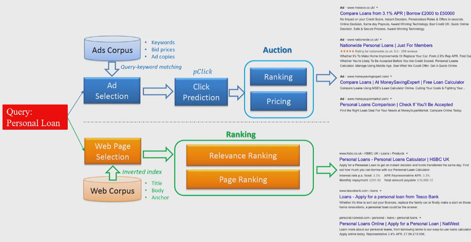
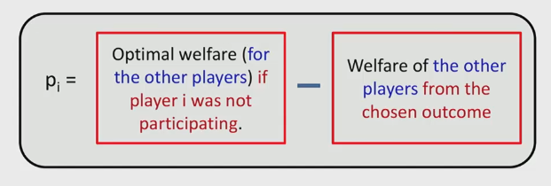

## Myerson's Optimal Auction

- Bidders submit a distribution instead of scalar value
- Each bidder has a private value $v_i$ drawn from the continuous, independent distribution
- Bidder with the highest virtual bid, calculated with their distribution, is charged the second highest value
- Item is only sold if reserve is met
- Myerson converted the revenue optimisation problem to a "virtual welfare" optimisation problem

This auction gives the highest expected revenue for all single item auctions. The only way to increase revenue is to increase the number of bidders.

The weak auction (second price) still generates greater than or equal revenue to Myerson's auction if it has $m + 1$ bidders compared to $m$ bidders. So adding more bidders always increases expected revenue.

## Multi Item Auctions

- Search engine advertisement

- Search engine's objective is to maxmise revenue
- Bidders' perspective is to have a set of keywords, and have a private value for each of the keywords
    - private daily/weekly/monthly budget
    - use their budget to buy clicks
- Most common payment method is pay-per-click
    - advertiser only pays if a user clicks on the link
- The value of a slot is very dependent on the client and the advertiser, so auctions are very important as to not place a single value on a slot 
    - this is a *price discovery mechanism*

### Selling multiple items

- The value of selling items individually has more value than selling them together
    - $v(S \cup T) \leq v(S) + v(T)$
- Some items, however, are complementary: they are worth more together than alone
    - $v(S \cup T) \geq v(S) + v(T)$

### VCG Auction

The payment of a winner is described as:

Which essentially means how much does the bidder's participation in the auction hurt other bidders. 

This is similar to the weak auction - in the weak auction, the highest bidder pays the highest bid if that bidder wasn't part of the auction. 

#### Pros

- Maximise social welfare, which is efficient
- Bidders are truthful since payment does not depend on the bidders offer

#### Cons

- Computationally intractable
- Specifying a bidders preferences is $2^m$
- VCG is not implemented for the sponsored search because of these problems

### Click Through Rate

$\text {CTR} _{ij}$ is the probability (based on historical data) of a user clicking on the $i$th slot containing ad $j$. By default, $\text {CTR} _{ij} \geq \text {CTR} _{i+1,j}$ - higher slots are more likely to be clicked.

Separable $\text {CTR}_{ij} = \alpha_i \times \beta_j$, where $\alpha_i$ is the quality of the slot, and $\beta_j$ is the quality of the bidder. 

Google's auction:
- bidders bid on a keyword
- highest bidder $b_1 \beta _1$ gets the first slot and receives $\alpha_1$ clicks in expectation.
- second highest bidder $b_2 \beta _2$ gets the second slot $\alpha_2$
- the highest bidder pays the second highest effective price: $p_1 = \frac {b_2 \beta_2} {\beta_1}$
- bidder $j$'s utility is $\text {CTR}_{ij} = v_j - p_j$

Generalised second price auction is not truthful, because the price they pay depends on their bid. So reporting a lower price 