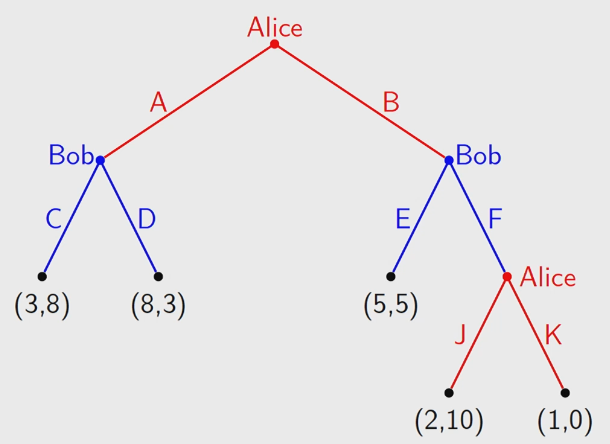
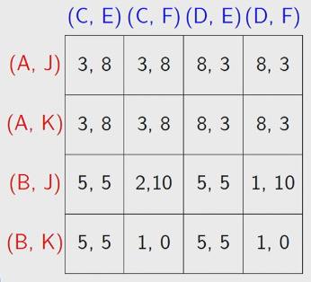

# Extensive Form Games

Different to normal form games, which can be represented in a matrix. Normal form is a one shot game, where every player chooses a strategy at the same time.

In extensive form games, strategies are revealed as the game goes on. They are represented by trees.

Perfect information means each player knows the payoffs of each other player after any move. Imperfect means that each player might not know the strategy that other players have used. 

## Pure Strategy

A pure strategy in a perfect information game is a complete specification of what the player will do at every node belonging to that player.

We can convert the game to a normal form game using the pure strategies. 

