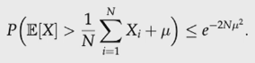
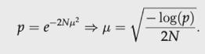
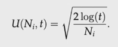
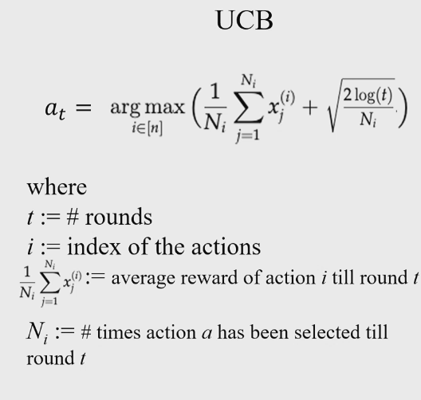

# Bandit Theory

Multi arm bandit theory is about pulling the arms of multiple slot machines, choosing which machine to pull each round.

More formally, the agent tries to maximise cumulative rewards by choosings actions (arms) without considering state transitions. The state never changes. 

Markov Decision Processes (MDP) changes state every time an action is taken. 

## Multi Arm Bandit Theory

To build up a belief of the expected returns, we *explore* the actions. We have to spend a number of actions exploring the arms, and then once we feel confident with the belief we *exploit* the belief. 

## The $\epsilon$-greedy approach

1. Choose an $0 < \epsilon < 1$, usually between 0.05 and 0.2
2. After 1 round of exploration, pull the machine with the highest return at a probability of $1 -\epsilon$.
3. Pull the remaining machines with the remaining probability. For example with three machines, the remaining 2 machines get a probability of $\frac {\epsilon} {2}$
4. Repeat. 

The decaying $\epsilon$-greedy method is the same, but $\epsilon$ decreases over time.

## Upper Confidence Bound Algorithm

This is an optimistic algorithm that always samples from the bandit with the highest score. The score is not only determined by the average, but by the average and a confidence bound. 

### Hoeffding's Inequality

For a variable $X \in (0,1)$. 

In practice, this allows us to evaluate how likely it is that we are underestimating the mean of a random vairable $X$. If we want this probability to be less that some number $p$, we have:

 

We define the $U$ function, the confidence score, to be:

The second term takes into account how confident we are that the mean we assign to a machine is accurate. For small number of samples, ie. small $N_i$, the value is large, meaning it is more likely to be explored further. 

## Regret

Regret is a measurement metric that is equal to the difference between the expected payout of the machine pulled and the best possible value of all the machines. 

The average regret is the total regret accumulated divided by the number of epochs. 

No-regret algorithms are ones that have average regret tending to zero as time steps approach infinity. For example, and algorithm with average regret of $\sqrt T$ at each time step $T$ has an average regret of:

$$\frac {\sqrt T} {T} = \frac {1} {\sqrt T}$$

which tends to 0 as $T \to \infty$. This is a no regret algorithm

- $\epsilon$-greedy regret grows linearly
- decaying $\epsilon$-greedy grows sublinearly
- UCB has logarithmic regret
    - no matter the distribution

