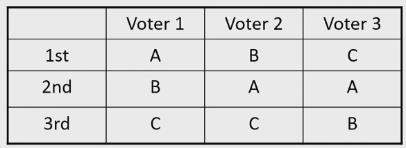
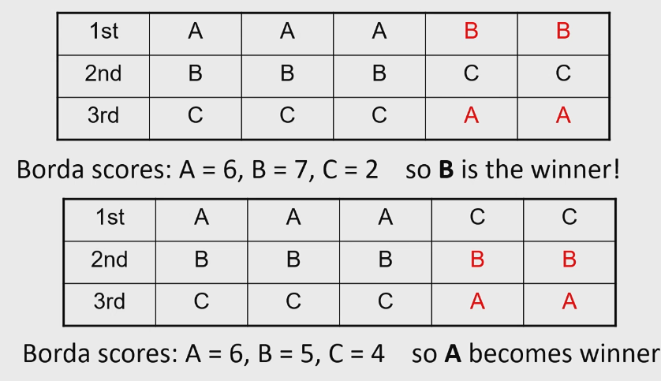

# Social Choice Theory

## Rank Aggregation

We do not want:
- Dictatorship: one person deciding who wins a vote
- Imposed rule: no matter how anyone vote, the winner is decided from the start

We want:
- Anonymity: all voters are treated equally. This is the opposite of dictatorship
- Neutrality: if candidates are renamed/relabeled, the winner of the vote remains the same. This is the opposite of the imposed rule. It means all candidates are treated equally
- Monotonicity: it is impossible for a candidate to receive votes and LOSE probability of winning the vote

## Majority Voting rule

- Every expert votes for their best candidate
- The candidates are ranked from most to least votes

## Condorcet Method

A candidate is a winner if they beat every other candidate in a one-on-one contest of majority rule. 

- the voters rank their best candidates from best to worst, and then each candidate is paired and contested against each other

Candidate A is preferred by majority vote to both B and C. 

### Problems
- There may not always be a winner when 3 or more candidates exist
- Voters can manipulate the result by changing their order and not being truthful

## Borda Counts

- Each expert provides a score to each candidate
- Scores range from 0 to $n-1$
- The aggregate is the sum of all the scores for each candidate
- Candidates are ordered based on this sum

### Pros
- satisfies monotonicity

### Cons
- Does not satisfy the property known as the independence of irrelevant alternatives
    - meaning "the social preferences between candidate A and B depend only on the individual preferences between A and B
    - this means that even if voters do not change their preference between A and B, but move the order of other candidates around, the outcome can change
    - does not satisfy Condercet criterion - even if pairwise, A has more preferences, it may not win

## Black's Rule

Simply select the Condorcet winner if one exists, otherwise select the Borda count winner.

## Copeland's Method

- In this method, count the pairwise winners and pairwise losers. 
- Each candidate's score is the wins minus the losses. 

## There is no perfect voting system

Arrow's Impossibility Theorem states that not all of the 3 properties can be satisfied for 3 candidates or more. 
