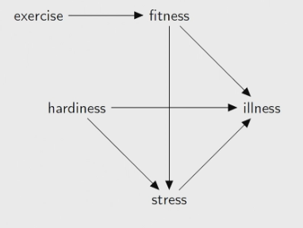
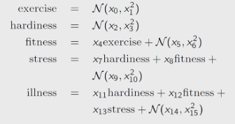

# Modelling

A model is a process for making predictions, generally. 
- We build models to answer questions.

Types of output
- Discrete - classification
- Continuous - regression
- Set - multi label classification
- Anything else - structured prediction

Types of uncertainty
- Aleatoric - random variables, like flipping a coin
- Epistemic - systematic model error (reducible)
- Inferential - both (most common, and separation is hard)

## Linear Regression

- Underdetermined: datapoints < parameters
- Overdetermined: datapoints > parameters

This generalises to all models: more parameters requires more data to train.

## Structural Equation Models

1. Explore the problem
2. Select relevant random variables
3. Create a graph of relationships between variables
    
4. Formulate equations
    

Any supervised learning algorithm can work for SEMs.

## Model Design

ML requires predictability. If there is a large gap between test and train, it will perform poorly on test.
- Chaotic models are impossible.

