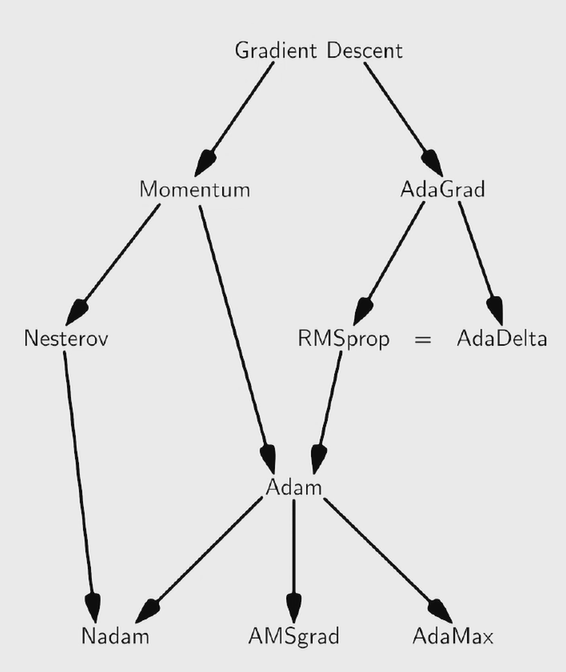
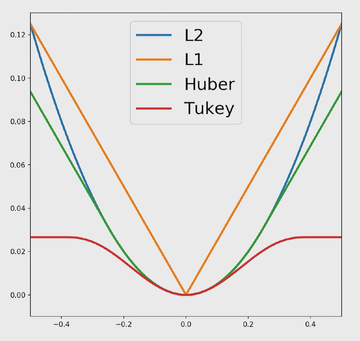

# Understanding Gradient Descent

We do not use gradient descent to train NNs, we use Adam.

## Adam

- Step size needs to be right
    - too high doesn't converge - it can explode
    - too slow takes too long
    - hand tuning can be impossible for many parameters

### Deceleration

- If the best cost seen doesn't improve for a while, decrease learning rate by some factor

### Momentum

- Uses past gradients to update current step
- Allows parameters to escape local minima

### Nesterov

- Same as momentum but evaluate gradient at the estimate of the *future position*
- Convergres much faster

### Backtracking line search

How to determine the initial step size?
- Finds a good initial step (which is expensive) but only initially

### AdaGrad

- Adaptive gradient
- Gradient descent focuses on the largest improvement only
- AdaGrad also focuses on smaller improvements
- As $G$ tends to infinity, the changes in parameters tend to 0.
- Use a rolling average instead

### Adam

### Stopping Condition

Stop when $\|\Delta_x f(x_t)\| < \epsilon$
- This stops at saddle points, but momentum can roll through this
- Instead, keep track of lowest cost and if this doesn't improve for $n$ iterations then stop

# Constraints

## Reparameterisation

- Transform $\phi \to r(\phi')$ to enforce constraints
- Optimise for new parameters $\argmin \limits _\phi (f(\phi)) \to \argmin \limits_{\phi'} (f(\phi'))$

## Projection

- Usual gradient descent
- If violating constraint, then snap to the closest satisfying point.
- Slow at boundary
- Must remove momentum

## Lagrange multipliers

- Change objective so that gradient is only zero when constraints are satisfied
- $\argmin \limits _{\phi, \lambda} (f(\phi) - \lambda g(\phi))$

# Initialisation

- Random restarts (shotgun hill climbing)
- Overparameterisation can cause many "decent" minima
- Initialise well to get close to a global minima
    - Heirarchy of models to find the global minima and increase complexity
        - Usually done by hand
- Constraints can cause bad local minima
    - Solve with constraints off, then turn them on
    - Use soft constraints - cost term for violating constraints

## Robust cost functions

- Tukey considers close points, but ignores further outliers, making solution more robust. 
    - New parameter to optimise.

## Random sample consensus (RANSAC)

- Chance of any point being an inlier are around 50%

## Global optimisers

Global optimisers are very expensive and often impossible.

- Binary search
- Branch and bound