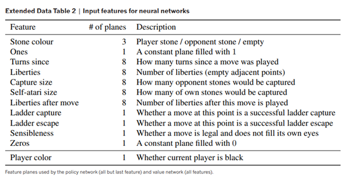
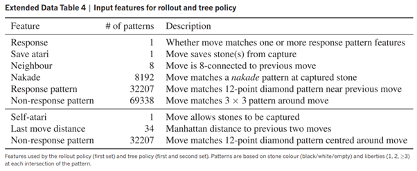
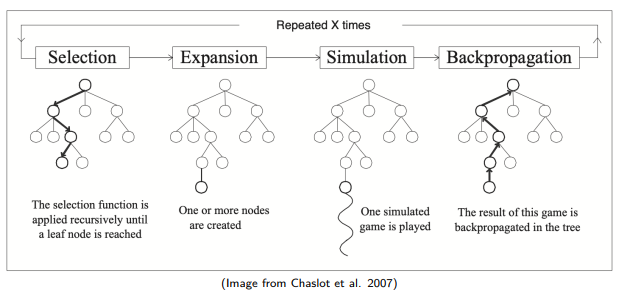

# 1. What is the paper about?

- Go was thought to be intractable, $250^{150}$ tree searches compared to chess at $35^{80}$.
- Minimax with alpha-beta pruning achieved superhuman performance in chess and the like, but not in Go.
- This paper is innovative because it uses neural networks to evaluate board positions and policy networks to select moves
    - Previous engines relied on handcrafted evaluation functions and brute force tree searches - too slow
    - Reinforcement learning via self play was new
    - rollout policy NN
- Monte carlo tree search simulates play by going down branches and averaging the number of wins and losses from that position, either by randomly selecting moves, or better by using a some policy to select moves. 
    - This method was replaced by NNs in alpha go, since they are faster than MCTS

# 2. What were the NNs?

1. Rollout Policy $\pi$
    - Super fast inference - $2 \mu$s
    - Lower accuracy ~24%
    - Used linear softmax classification
    - Small pattern features as input and produced a distribution over legal moves
2. SL Policy $\sigma$
    - Slower inference - $3$ms
    - Higher accuracy ~55%
    - More input data (19x19x48)
    - Alternating convolutional layers and ReLU
    - Also outputs a probability distribution over legal moves
3. RL Policy network $\rho$
    - Will go into more detail later
    - Copies weights from SL and updates by self play
    - Trained on dataset of self-played positions (i.i.d.)
4. Value network
    - Also trained on self play positions
    - Similar architecture to $\sigma$ and $\rho$ but flattens after final convolutional layer and outputs single scalar ($\tanh$)
    - Trained to estimate whether a position ends in a game winning or losing, in other words estimating the value of the game.

# 3. Inputs 

30,000,000 dataset, and self play dataset

## SL, RL, and Value network

Uses lots of positional data

## Rollout policy

Uses pattern data

# 4. How are moves selected and evaluated? (MCTS)

## High(ish) level

- Assume existence of tree.
- Traverse edges by picking edge with highest $Q + u(P)$ value.
    - $Q$ is a function of number of visits and the value assigned by the Value network.
    - $u(P)$ is a bonus function of the prior probability (calculated by the larger SL network) and the number of visits
- Once a leaf node is reached, use larger SL network to calculate prior probabilities

## Low(ish) level

1. Selection
    - Select the move with the highest score
    - Also takes into account a bonus - proportional to number of visits
        - Exploration! UCB
    - Repeated until leaf node is found, which is evaluate by the larger SL policy.
2. Expansion
    - Create new nodes from the current node 
3. Simulation
    - Simulate nodes to end of game with rollout policy
4. Backpropagation
    - Backpropagate the result through the tree, updating values

- Tree is traversed by picking the action with highest score, until a leaf node is reached
- Leaf node is evaluated using SL policy (bigger one)
    - Simulation using rollout policy to select moves from the leaf node

# 5. How is the RL policy trained?

- The weights from the pre-trained SL policy and copied to the new RL policy
- The policy plays previous iterations of itself
    - The previous iterations are randomly selected
    - This prevents overfitting to the current policy's play

- the loss function

# 6. Results