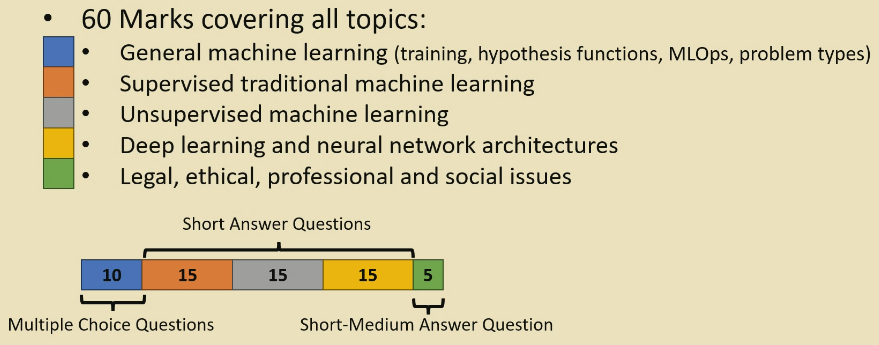
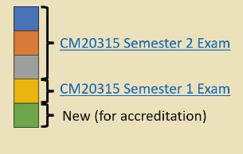

# Semester 2 Exams and Topics

## Algorithms

75% Exam

- DFAs
- NFAs
    - conversion to DFA
- Regular Languages
- Regex
- Pumping Lemma
- Context Free Languages
    - CFGs
- Pushdown Automata
- Non-context free languages
- Turing Machines
- Church Turing Thesis
- Complexity

Use exercise sheets as practice for exams.  

- Semester 1 content past papers can be found [here](https://www.bath.ac.uk/library/exampapers/?code=CM20217).
- Semester 2 content [here](https://www.bath.ac.uk/library/exampapers/?code=CM20254).
- Focus on 2022/23 and 2023/24 papers. 

## Machine Learning

70% Exam

Read the book - chapters 1-7.
Lab notebooks

- Guest lectures are EXAMINABLE.

### Exam format

## Visual Computing

50% Exam - MCQ

"Computer Vision" past papers.

- Guest lectures are NON examinable.
- 30% S1 content
- 70% S2 content

All topics listed [here](https://moodle.bath.ac.uk/mod/forum/discuss.php?d=538804).

## Foundations and Frontiers

50% Exam

Past papers